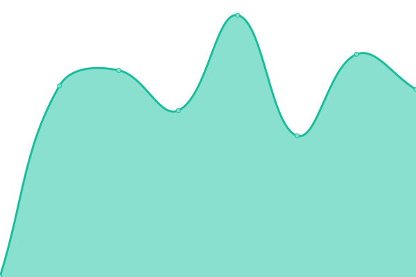

# [📈 Live Status](https://status.fsphys.de): <!--live status--> **🟧 Partial outage**

This repository contains the open-source uptime monitor and status page for [Fachschaft Physik am KIT](https://fachschaft.physik.kit.edu/), powered by [Upptime](https://github.com/upptime/upptime).

With [Upptime](https://upptime.js.org), you can get your own unlimited and free uptime monitor and status page, powered entirely by a GitHub repository. We use [Issues](https://github.com/fsphys/status.fsphys.de/issues) as incident reports, [Actions](https://github.com/fsphys/status.fsphys.de/actions) as uptime monitors, and [Pages](https://status.fsphys.de) for the status page.

<!--start: status pages-->
<!-- This summary is generated by Upptime (https://github.com/upptime/upptime) -->
<!-- Do not edit this manually, your changes will be overwritten -->
<!-- prettier-ignore -->
| URL | Status | History | Response Time | Uptime |
| --- | ------ | ------- | ------------- | ------ |
|  [FS - Website](https://fachschaft.physik.kit.edu) | 🟩 Up | [fs-website.yml](https://github.com/fsphys/status.fsphys.de/commits/HEAD/history/fs-website.yml) | 

 1492ms
     
 | 

<a href="https://status.fsphys.de/history/fs-website">100.00%</a>
    

|  [FS - GitLab](https://fs.physik.kit.edu/gitlab/) | 🟩 Up | [fs-git-lab.yml](https://github.com/fsphys/status.fsphys.de/commits/HEAD/history/fs-git-lab.yml) | 

 1452ms
     
 | 

<a href="https://status.fsphys.de/history/fs-git-lab">100.00%</a>
    

|  [FS - Mattermost](https://fsmm.physik.kit.edu/) | 🟥 Down | [fs-mattermost.yml](https://github.com/fsphys/status.fsphys.de/commits/HEAD/history/fs-mattermost.yml) | 

 0ms
     
 | 

<a href="https://status.fsphys.de/history/fs-mattermost">0.00%</a>
    

|  [Platform - Jitsi](https://meet.physik.kit.edu) | 🟩 Up | [platform-jitsi.yml](https://github.com/fsphys/status.fsphys.de/commits/HEAD/history/platform-jitsi.yml) | 

 980ms
     
 | 

<a href="https://status.fsphys.de/history/platform-jitsi">100.00%</a>
    

|  [Platform - Landing Page](https://platform.physik.kit.edu) | 🟩 Up | [platform-landing-page.yml](https://github.com/fsphys/status.fsphys.de/commits/HEAD/history/platform-landing-page.yml) | 

 713ms
     
 | 

<a href="https://status.fsphys.de/history/platform-landing-page">100.00%</a>
    

|  [Platform - HedgeDoc](https://platform.physik.kit.edu/hedgedoc/) | 🟩 Up | [platform-hedge-doc.yml](https://github.com/fsphys/status.fsphys.de/commits/HEAD/history/platform-hedge-doc.yml) | 

 821ms
     
 | 

<a href="https://status.fsphys.de/history/platform-hedge-doc">100.00%</a>
    

<!--end: status pages-->

[**Visit our status website →**](https://status.fsphys.de)

## 📄 License

- Powered by: [Upptime](https://github.com/upptime/upptime)
- Code: [MIT](./LICENSE) © [Fachschaft Physik am KIT](https://fachschaft.physik.kit.edu/)
- Data in the `./history` directory: [Open Database License](https://opendatacommons.org/licenses/odbl/1-0/)
